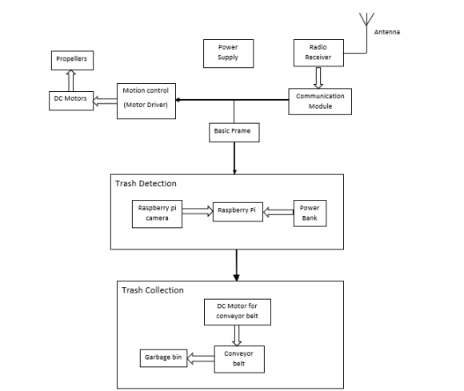
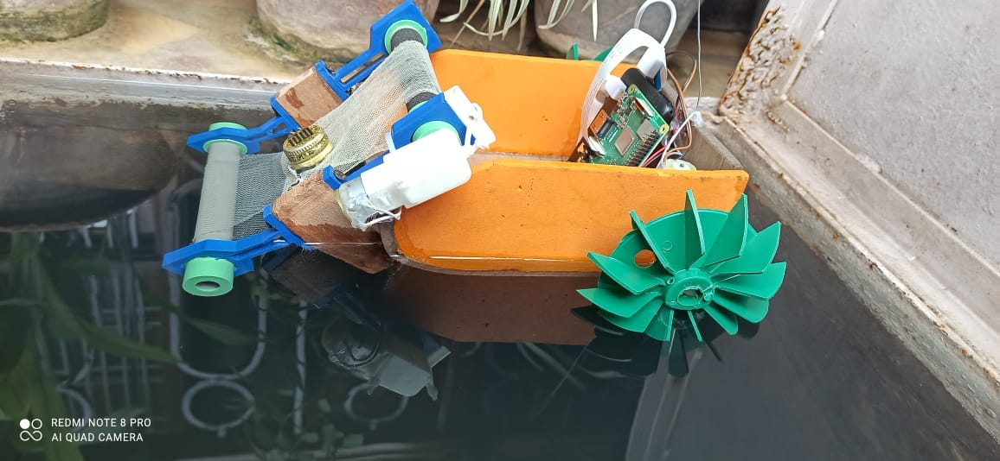

# Robotic Fish 🐟

## Tools Used ⚙️ 🛠️ 
* Hardware 
  * Raspberry Pi with camera
  * Conveyor Belt
  * Propellers
  * Dc motors, Remote controller
* Software 
  * YOLO v3
  * CNN
  * openCV
  * MATLAB

# Yolo v3 (You look only once)  
You Only Look Once is one of the object detection algorithms. It uses single Convolutional neural network which simultaneously predicts multiple bounding boxes and class
probabilities for these boxes. It allows model to look at the whole image at the test time. In YOLO prediction is based on 1x1 convolutions. 

## Introduction :  
Trash accumulation in water bodies adversely affect the marine ecosystems and pose a
long-term threat to aquatic species. This vast amount of trash in the water sources
that injures aquatic life and contaminates the water must be removed periodically. An
effective strategy for removing debris from marine environment is the use of autonomous
underwater vehicles for trash detection and removal

## Objectives :  
1. To build a robot that moves smoothly on the surface of the water.
2. To remotely control the robotic fish using Radio Frequency (RF) technology.
3. To make the robot capable of finding and collecting certain kinds of trash like small
plastic covers and bottle caps floating on the surface of water.

## System Overview :  
The project can be divided into mainly three parts. First part is the robot design which
includes motion control of the robot. Second part is to detect the debris and the third
part is to collect the debris based on the detection results. 

## Result  

## Links : 
1. Object detection using OpenCV - https://www.pyimagesearch.com/2017/10/16/raspberry-pi-deep-learning-object-detection-with-opencv/
2. Object detection using YOLO - https://towardsdatascience.com/yolo-object-detection-with-opencv-and-python-21e50ac599e9
3. Object detection using MATLAB - https://www.mathworks.com/help/vision/ug/object-detection-using-yolo-v3-deep-learning.html

